# 2D Lights

It's an offline 2D Light renderer. Uses a mix of Ray Marching and Path tracing techniques to render.

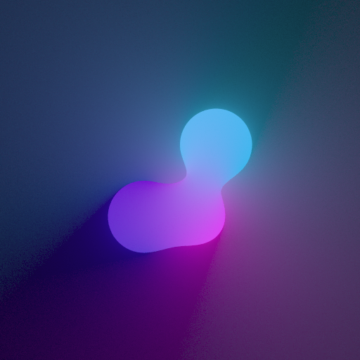

# Features
## Shapes
The renderer uses ray marching, that's why it can render multiple shapes:

    - Circle
    - Box
    - Line
    - Plane
    - Pentagon
    - Arc
    - Heart
    - Egg

## Materials

Materials determine how an object interacts with light.

- ***Emission and intensity***
- ***Reflectance***: Schlick's approximation of Fresnel equations
- ***Refraction***: Snell's law and total internal reflection
- ***Absorption***: Beer Lambert

## Outputs

The renderer outputs an Image object, that holds the 24 bit RGB buffer. Then on_render_callback, stores *.png* images using STB

There is also the possibility of generating image sequences, that when joined make a video

## Goal
The main goal of this project was to learn about PBR (Physically Based Rendering) in a simple environment, where no GPU and 3D graphics is required. 

## Samples

### Solid objects

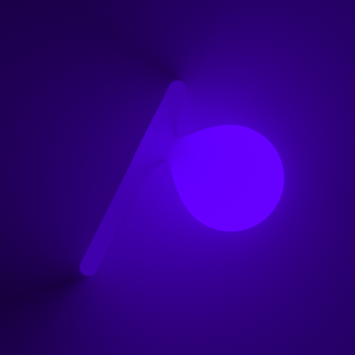
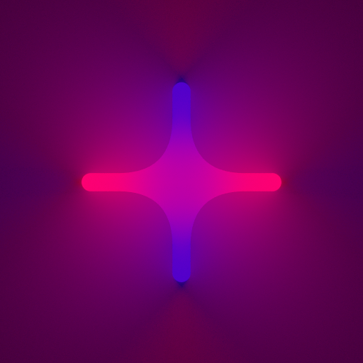

#### Caustics effect

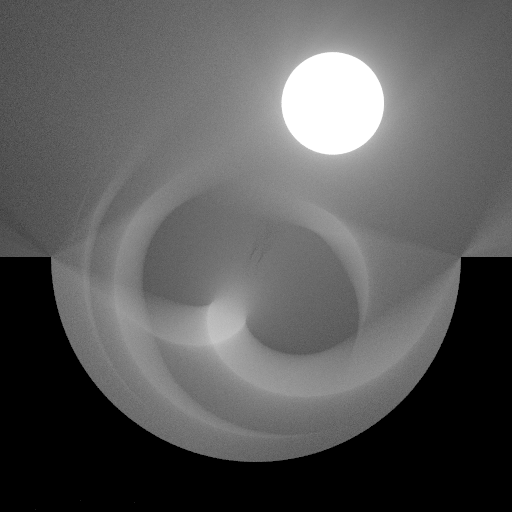

### Lens

Circular:

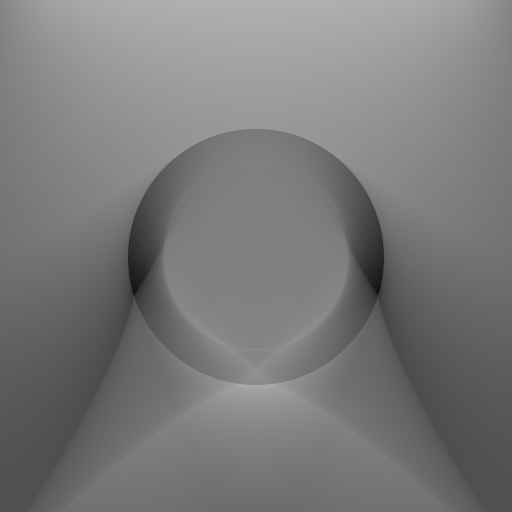

Convex:

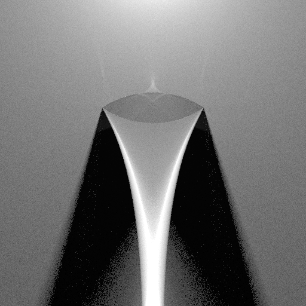

Concave:

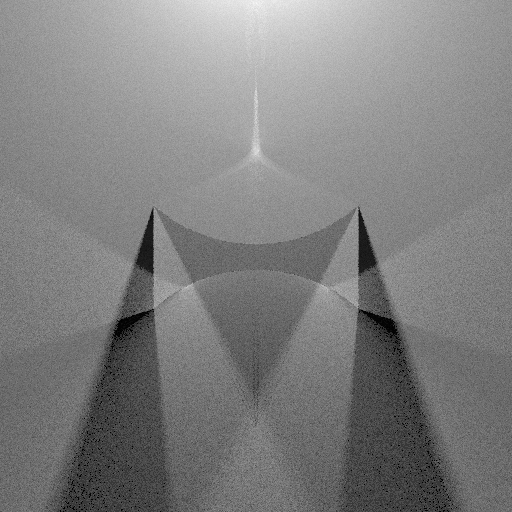

Semicircular:

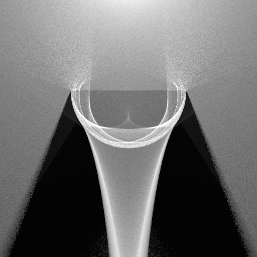

### Glass

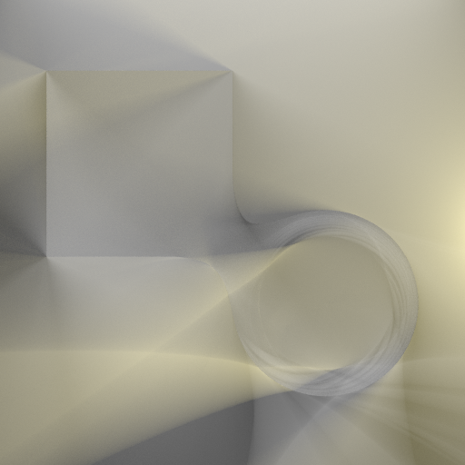

### Light absorption

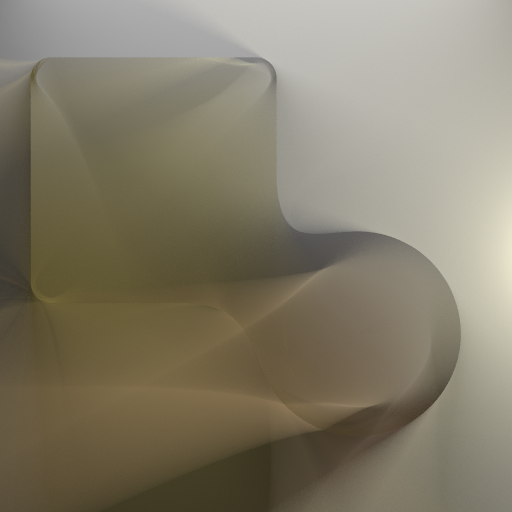

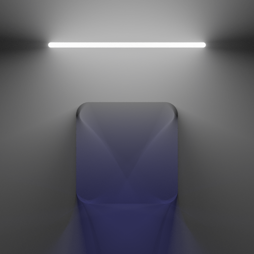

## Video
https://github.com/FrancoYudica/2D-Lights/assets/56238054/31cf1045-c06c-467e-b1f1-9d66fe156f23

